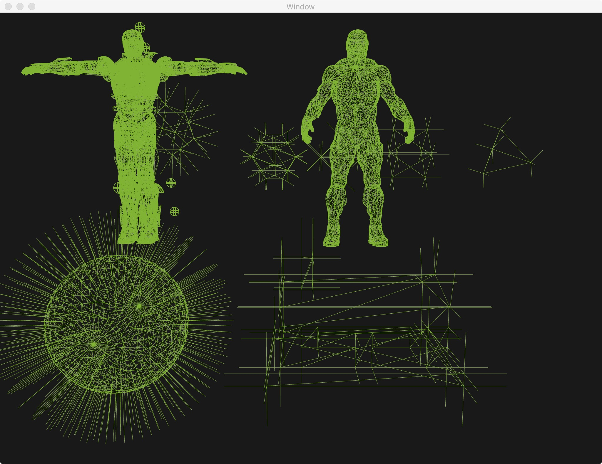
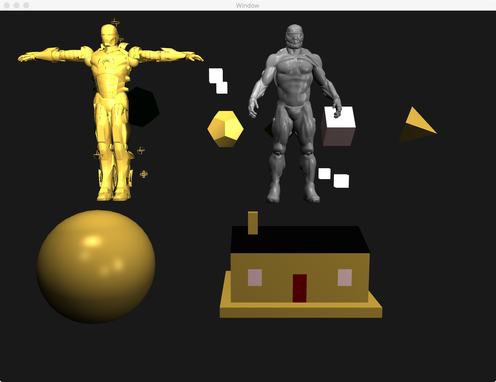
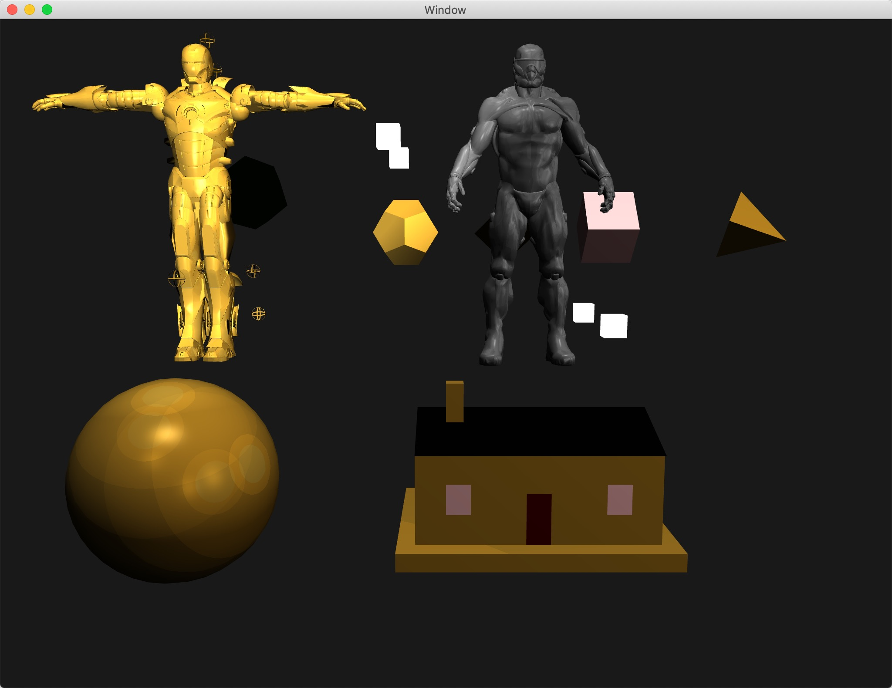

# OpenGL-3D-House

## 1. normal and meshes
The normal has been visualized it can be view by press “N” key and rotate with press “R” key:

## 2. Light types.
- “0” key to get direction light, “1” key to get a spotlight
- “2” key to get point lights, “3” key to get all the lights combine,
- “4” key rotate the point light positions. “R” key to get objects rotations, and all the previous mentioned keys to get view different light model during rotation.

## 3. Phong shading and Gouraud shading
The default mode is Phong Shading, Press “G” key will shift to Gouraud shading, Press one “G” more time to back Phong shading. 
Press “2” or “P” key gets four point-lights with Phong lighting model.

## 4.Lighting models (Phong, Cook-Torrance, Oren-Nayar, Ward, Heidrich-Seidel,Cartoon) 
- Press"C"key, Cook-Torrance
- Press "O", Oren-Nayar
- Press"W", Ward
- "T", cartoon light

